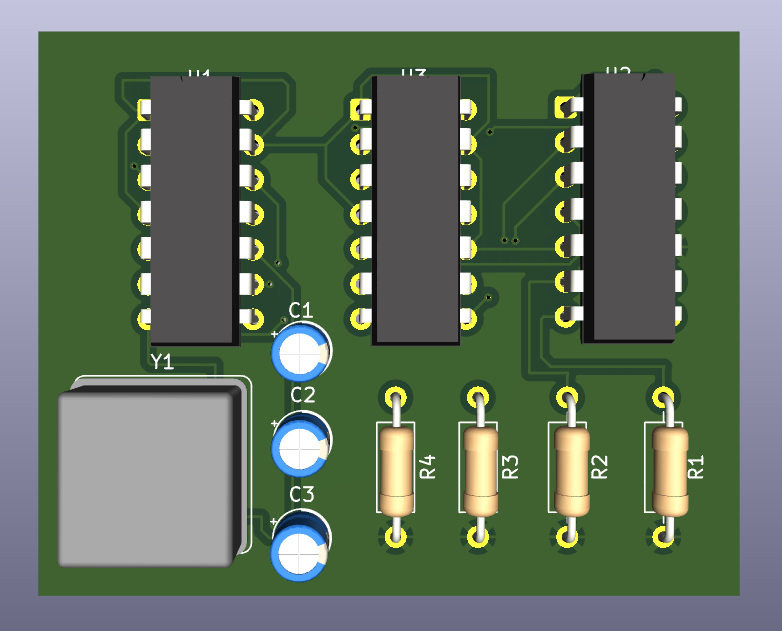
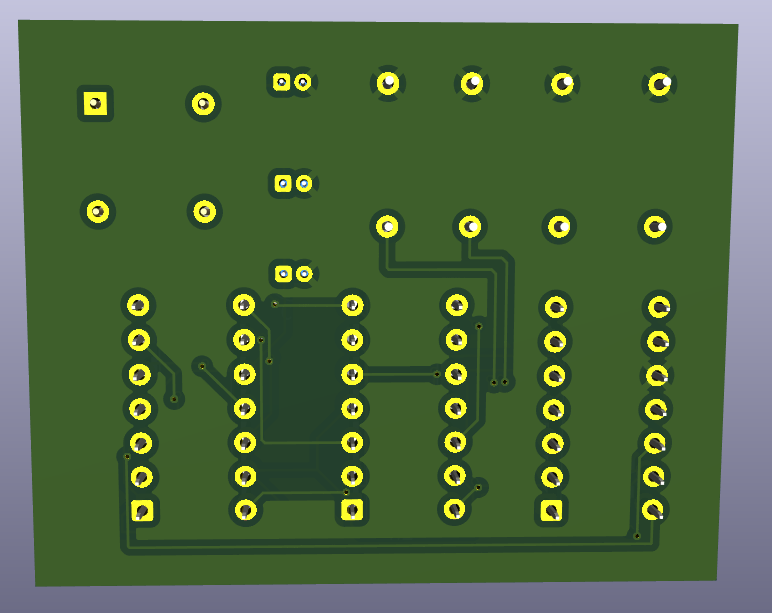
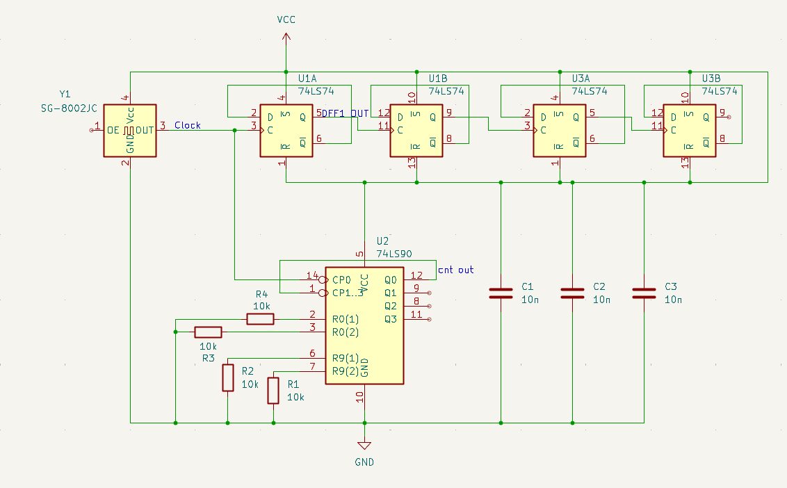
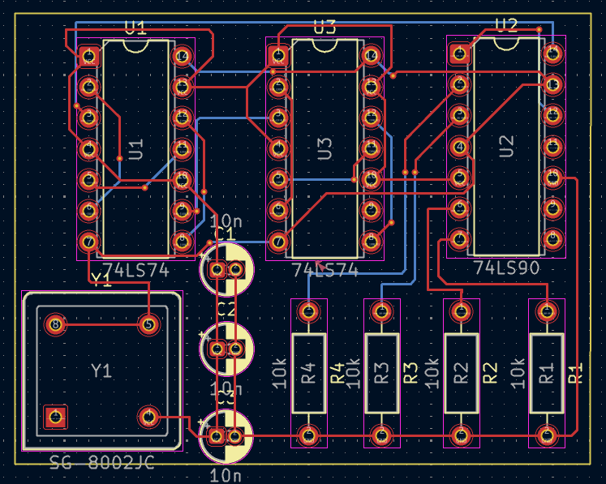
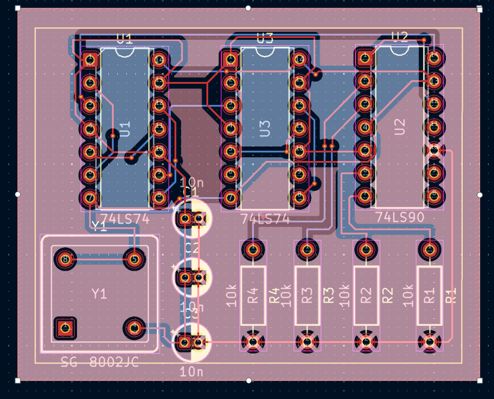

# ⚡ High-Speed Frequency Divider Board

<div align="center">



[](LICENSE)
[](https://www.kicad.org/)
[](#)
[](#)

### Digital Electronics PCB Design Project
**Introduction to PCB Design Course**

*2025 | מבוא לתכן כרטיסים*

[View Schematic](#-circuit-schematic) • [PCB Design](#-pcb-design) • [Components](#-hardware-components) • [Assembly](#-assembly-guide)

</div>

---

## 📋 Table of Contents

- [Overview](#-overview)
- [Key Features](#-key-features)
- [Circuit Description](#-circuit-description)
- [Circuit Schematic](#-circuit-schematic)
- [Hardware Components](#-hardware-components)
- [PCB Design](#-pcb-design)
- [Technical Specifications](#-technical-specifications)
- [Assembly Guide](#-assembly-guide)
- [Design Files](#-design-files)
- [Testing & Verification](#-testing--verification)
- [Applications](#-applications)
- [References](#-references)
- [License](#-license)

---

## 🎯 Overview

The **High-Speed Frequency Divider Board** is a digital electronics project designed to divide high-frequency clock signals using TTL logic ICs. This PCB implements a frequency division chain using **74LS74 D-type Flip-Flops** and a **74LS90 Decade Counter**, driven by an **SG-8002JC Crystal Oscillator**.

The board is designed to take a high-frequency input signal and produce multiple divided output frequencies, making it useful for clock distribution, timing circuits, and frequency synthesis applications.



---

## ✨ Key Features

### 🔄 Frequency Division
- **Cascaded Flip-Flop Architecture**: Multiple 74LS74 D flip-flops in series
- **Decade Counter Stage**: 74LS90 provides divide-by-10 capability
- **Multiple Division Ratios**: Outputs at various division stages

### ⚡ High-Speed Operation
- **Crystal Oscillator**: SG-8002JC for stable, precise clock generation
- **TTL Logic**: Fast switching times with 74LS series ICs
- **Low Propagation Delay**: Optimized signal routing

### 🛡️ Signal Integrity
- **Decoupling Capacitors**: Three 10nF capacitors for noise filtering
- **Pull-up Resistors**: Four 10kΩ resistors for proper logic levels
- **Clean PCB Layout**: Optimized trace routing for minimal interference

### 🔧 Design Quality
- **Professional PCB Design**: Created in KiCad
- **Compact Form Factor**: Efficient component placement
- **Through-Hole Components**: Easy manual assembly

---

## 🔌 Circuit Description

### System Architecture

The frequency divider operates as follows:

```
┌─────────────────────────────────────────────────────────────────────────────┐
│                        FREQUENCY DIVIDER SYSTEM                             │
└─────────────────────────────────────────────────────────────────────────────┘
                                    │
        ┌───────────────────────────┴───────────────────────────┐
        │                                                       │
┌───────▼───────┐                                               │
│    Y1         │                                               │
│  SG-8002JC    │──── Clock Signal ────┐                        │
│  Oscillator   │                      │                        │
└───────────────┘                      │                        │
                                       │                        │
                              ┌────────▼────────┐               │
                              │      U1A        │               │
                              │    74LS74       │── Q ──┐       │
                              │  D Flip-Flop    │       │       │
                              └────────┬────────┘       │       │
                                       │                │       │
                              ┌────────▼────────┐       │       │
                              │      U1B        │       │       │
                              │    74LS74       │── Q ──┼───┐   │
                              │  D Flip-Flop    │       │   │   │
                              └────────┬────────┘       │   │   │
                                       │                │   │   │
                              ┌────────▼────────┐       │   │   │
                              │      U3A        │       │   │   │
                              │    74LS74       │── Q ──┼───┼───┤
                              │  D Flip-Flop    │       │   │   │
                              └────────┬────────┘       │   │   │
                                       │                │   │   │
                              ┌────────▼────────┐       │   │   │
                              │      U3B        │       │   │   │
                              │    74LS74       │── Q ──┼───┼───┤
                              │  D Flip-Flop    │       │   │   │
                              └────────┬────────┘       │   │   │
                                       │                │   │   │
                              ┌────────▼────────┐       │   │   │
                              │      U2         │       │   │   │
                              │    74LS90       │── Q0-Q3 ──┼───┤
                              │ Decade Counter  │       │   │   │
                              └─────────────────┘       │   │   │
                                                        │   │   │
                              ┌──────────────────────────┘   │   │
                              │  ┌───────────────────────────┘   │
                              │  │  ┌────────────────────────────┘
                              ▼  ▼  ▼
                        ┌─────────────────┐
                        │  Divided Output │
                        │   Frequencies   │
                        │  (cnt out)      │
                        └─────────────────┘
```

### Functional Description

| Stage | Component | Function | Division Ratio |
|-------|-----------|----------|----------------|
| **Clock Source** | Y1 (SG-8002JC) | Crystal oscillator generates stable reference clock | 1:1 (Source) |
| **Stage 1** | U1A (74LS74) | First D flip-flop divides clock by 2 | ÷2 |
| **Stage 2** | U1B (74LS74) | Second D flip-flop for additional division | ÷2 |
| **Stage 3** | U3A (74LS74) | Third D flip-flop continues division chain | ÷2 |
| **Stage 4** | U3B (74LS74) | Fourth D flip-flop | ÷2 |
| **Counter** | U2 (74LS90) | Decade counter provides divide-by-10 | ÷10 |

### Signal Flow

1. **Clock Generation**: The SG-8002JC oscillator generates a high-frequency square wave
2. **Initial Division**: The clock feeds into the first 74LS74 D flip-flop (U1A)
3. **Cascade Division**: Each subsequent flip-flop divides the frequency by 2
4. **Decade Counting**: The 74LS90 provides divide-by-10 functionality with 4-bit BCD output
5. **Output**: Multiple divided frequencies available at various outputs

---

## 📐 Circuit Schematic

### Main Schematic Diagram



### Component Connections

#### Crystal Oscillator (Y1 - SG-8002JC)
| Pin | Function | Connection |
|-----|----------|------------|
| 1 | OE (Output Enable) | Connected |
| 2 | GND | Ground |
| 3 | OUT | Clock signal to U1A |
| 4 | VCC | +5V Power |

#### D Flip-Flops (U1, U3 - 74LS74)
Each 74LS74 contains two D flip-flops with the following pinout:

| Pin | Function |
|-----|----------|
| 1, 13 | CLR (Clear) |
| 2, 12 | D (Data Input) |
| 3, 11 | CLK (Clock) |
| 4, 10 | PRE (Preset) |
| 5, 9 | Q (Output) |
| 6, 8 | Q̄ (Inverted Output) |
| 7 | GND |
| 14 | VCC |

#### Decade Counter (U2 - 74LS90)
| Pin | Function | Connection |
|-----|----------|------------|
| 1 | CP1 (Clock Input 1) | From flip-flop chain |
| 2, 3 | R0(1), R0(2) | Reset inputs with pull resistors |
| 5 | VCC | +5V Power |
| 6, 7 | R9(1), R9(2) | Set-9 inputs |
| 8, 9, 11, 12 | Q3, Q2, Q1, Q0 | BCD Outputs (cnt out) |
| 10 | GND | Ground |
| 14 | CP0 (Clock Input 0) | Input |

---

## 🔌 Hardware Components

### Bill of Materials (BOM)

| Reference | Component | Value/Part Number | Quantity | Description |
|-----------|-----------|-------------------|----------|-------------|
| **U1** | 74LS74 | 74LS74 | 1 | Dual D-Type Positive-Edge-Triggered Flip-Flop |
| **U2** | 74LS90 | 74LS90 | 1 | Decade Counter |
| **U3** | 74LS74 | 74LS74 | 1 | Dual D-Type Positive-Edge-Triggered Flip-Flop |
| **Y1** | Crystal Oscillator | SG-8002JC | 1 | High-Frequency Crystal Oscillator |
| **C1** | Capacitor | 10nF | 1 | Ceramic Decoupling Capacitor |
| **C2** | Capacitor | 10nF | 1 | Ceramic Decoupling Capacitor |
| **C3** | Capacitor | 10nF | 1 | Ceramic Decoupling Capacitor |
| **R1** | Resistor | 10kΩ | 1 | Pull-up/Pull-down Resistor |
| **R2** | Resistor | 10kΩ | 1 | Pull-up/Pull-down Resistor |
| **R3** | Resistor | 10kΩ | 1 | Pull-up/Pull-down Resistor |
| **R4** | Resistor | 10kΩ | 1 | Pull-up/Pull-down Resistor |

### Component Specifications

#### 74LS74 - Dual D Flip-Flop
- **Type**: TTL, Low-Power Schottky
- **Propagation Delay**: ~25ns typical
- **Operating Voltage**: 4.75V to 5.25V
- **Max Clock Frequency**: ~25 MHz
- **Package**: DIP-14

#### 74LS90 - Decade Counter
- **Type**: TTL, Low-Power Schottky
- **Count Sequence**: 0-9 (BCD)
- **Operating Voltage**: 4.75V to 5.25V
- **Max Count Frequency**: ~32 MHz
- **Package**: DIP-14

#### SG-8002JC - Crystal Oscillator
- **Type**: CMOS Crystal Oscillator
- **Output**: Square wave
- **Voltage**: 5V CMOS/TTL compatible
- **Package**: 4-pin DIP

---

## 🖥️ PCB Design

### PCB Layout Overview

The PCB was designed using **KiCad** EDA software with careful attention to signal integrity and manufacturability.

#### Top Layer (Component Side)


#### Bottom Layer (Solder Side)


### PCB Layout Editor Views

#### Layout with Component Footprints


#### Layout with VCC and GND Routing


### Design Specifications

| Parameter | Value |
|-----------|-------|
| **Board Dimensions** | Compact form factor |
| **Layers** | 2 (Top & Bottom) |
| **Copper Weight** | 1 oz (35µm) |
| **Min Track Width** | 0.25mm (10 mil) |
| **Min Clearance** | 0.2mm (8 mil) |
| **Via Size** | Standard through-hole |
| **Surface Finish** | HASL or ENIG |
| **Solder Mask** | Green |
| **Silkscreen** | White |

### Layout Design Considerations

#### Power Distribution
- **VCC Rail**: Connected to all IC VCC pins (Pin 14 on U1, U2, U3; Pin 4 on Y1)
- **GND Rail**: Connected to all IC GND pins (Pin 7 on U1, U2, U3; Pin 2 on Y1)
- **Decoupling**: 10nF capacitors placed close to each IC power pins

#### Signal Routing
- **Clock Signal**: Short, direct trace from oscillator to first flip-flop
- **Cascade Connections**: Q output of each flip-flop connected to D input of next
- **Output Traces**: BCD outputs from 74LS90 routed to edge connector

#### Component Placement
- **ICs**: Aligned in rows for efficient routing
- **Oscillator**: Positioned near input stage
- **Capacitors**: Close to respective IC power pins
- **Resistors**: Grouped together for easy identification

---

## 📊 Technical Specifications

### Electrical Specifications

| Parameter | Min | Typical | Max | Unit |
|-----------|-----|---------|-----|------|
| **Supply Voltage (VCC)** | 4.75 | 5.0 | 5.25 | V |
| **Supply Current** | - | 50 | 100 | mA |
| **Input High Voltage** | 2.0 | - | - | V |
| **Input Low Voltage** | - | - | 0.8 | V |
| **Output High Voltage** | 2.4 | 3.4 | - | V |
| **Output Low Voltage** | - | 0.25 | 0.4 | V |

### Timing Specifications

| Parameter | Typical | Max | Unit |
|-----------|---------|-----|------|
| **74LS74 Propagation Delay (tPLH)** | 15 | 25 | ns |
| **74LS74 Propagation Delay (tPHL)** | 15 | 25 | ns |
| **74LS90 Count Frequency** | - | 32 | MHz |
| **Maximum System Frequency** | ~25 | - | MHz |

### Division Ratios Available

| Output | Division Ratio | Frequency (if input = 10MHz) |
|--------|---------------|------------------------------|
| After U1A | ÷2 | 5 MHz |
| After U1B | ÷4 | 2.5 MHz |
| After U3A | ÷8 | 1.25 MHz |
| After U3B | ÷16 | 625 kHz |
| U2 Q0 | ÷20 | 500 kHz |
| U2 Q1 | ÷40 | 250 kHz |
| U2 Q2 | ÷80 | 125 kHz |
| U2 Q3 | ÷160 | 62.5 kHz |

---

## 🔧 Assembly Guide

### Required Tools
- Soldering iron (temperature-controlled, 300-350°C)
- Lead-free solder (0.8mm diameter recommended)
- Flux (optional, but helpful)
- Wire cutters
- Desoldering pump or wick (for corrections)
- Multimeter
- Oscilloscope (for testing)

### Assembly Steps

#### Step 1: Prepare the PCB
1. Inspect the PCB for any manufacturing defects
2. Clean the board surface if necessary
3. Gather all components from the BOM

#### Step 2: Install Resistors (R1-R4)
1. Identify the 10kΩ resistors (brown-black-orange color code)
2. Insert into designated positions (R1, R2, R3, R4)
3. Bend leads on bottom side
4. Solder and trim excess leads

#### Step 3: Install Capacitors (C1-C3)
1. Note: Ceramic capacitors are non-polarized
2. Insert 10nF capacitors into C1, C2, C3 positions
3. Solder and trim leads

#### Step 4: Install IC Sockets (Recommended)
1. Use 14-pin DIP sockets for U1, U2, U3
2. Align notch with silkscreen marking
3. Solder all pins

#### Step 5: Install Crystal Oscillator (Y1)
1. Insert SG-8002JC into Y1 position
2. Verify correct orientation (Pin 1 alignment)
3. Solder all 4 pins

#### Step 6: Insert ICs
1. **U1 (74LS74)**: First dual flip-flop
2. **U2 (74LS90)**: Decade counter
3. **U3 (74LS74)**: Second dual flip-flop
4. Align Pin 1 notch with socket notch

#### Step 7: Final Inspection
1. Check for solder bridges
2. Verify all components are correctly oriented
3. Confirm no cold solder joints

---

## 📁 Design Files

### Repository Contents

| File/Folder | Description |
|-------------|-------------|
| `FinalProject_KiCad.zip` | Complete KiCad project files (schematic, PCB, libraries) |
| `Schematic.png` | Circuit schematic diagram |
| `PCB.png` | 3D render of PCB (top view) |
| `PCB2.png` | 3D render of PCB (bottom view) |
| `physical_connected.png` | PCB layout view |
| `physical_connected_withVCCandGND.png` | PCB layout with power routing highlighted |
| `LICENSE` | MIT License file |
| `מבוא לתכן כרטיסים - מטלת סוף.docx` | Project documentation (Hebrew) |

### KiCad Project Structure

The `FinalProject_KiCad.zip` contains:
```
FinalProject_KiCad/
├── FinalProject.kicad_pro    # Project file
├── FinalProject.kicad_sch    # Schematic file
├── FinalProject.kicad_pcb    # PCB layout file
├── FinalProject.kicad_prl    # Local settings
├── fp-lib-table              # Footprint library table
├── sym-lib-table             # Symbol library table
└── gerber/                   # Manufacturing files (if generated)
```

---

## 🧪 Testing & Verification

### Basic Functionality Test

#### Power-Up Test
1. Connect 5V power supply (ensure correct polarity)
2. Measure current consumption (should be ~50-100mA)
3. Verify VCC at all IC power pins

#### Signal Verification
1. **Oscillator Output**: Probe Pin 3 of Y1, verify clock signal
2. **Division Stages**: Probe Q outputs of each flip-flop
3. **Counter Outputs**: Check Q0-Q3 of 74LS90

### Expected Waveforms

```
Oscillator (Y1 Pin 3):    ┌─┐ ┌─┐ ┌─┐ ┌─┐ ┌─┐ ┌─┐ ┌─┐ ┌─┐
                          │ │ │ │ │ │ │ │ │ │ │ │ │ │ │ │
                        ──┘ └─┘ └─┘ └─┘ └─┘ └─┘ └─┘ └─┘ └──

U1A Q (÷2):               ┌───┐   ┌───┐   ┌───┐   ┌───┐
                          │   │   │   │   │   │   │   │
                        ──┘   └───┘   └───┘   └───┘   └────

U1B Q (÷4):               ┌───────┐       ┌───────┐
                          │       │       │       │
                        ──┘       └───────┘       └────────
```

### Troubleshooting

| Issue | Possible Cause | Solution |
|-------|----------------|----------|
| No output | Power not connected | Check VCC and GND connections |
| No oscillation | Bad oscillator | Replace Y1, verify voltage |
| Erratic output | Poor connections | Reflow solder joints |
| Wrong frequency | IC not seated properly | Reseat ICs in sockets |
| High current | Short circuit | Inspect for solder bridges |

---

## 🎯 Applications

This frequency divider board can be used in various applications:

### 🕐 Clock Distribution
- Generating multiple clock frequencies from a single source
- Clock domain crossing circuits
- Synchronous system timing

### 📡 Communication Systems
- Baud rate generators
- Frequency synthesis
- PLL reference dividers

### 📊 Measurement Equipment
- Frequency counters
- Time base generators
- Test equipment

### 🎓 Educational Purposes
- Digital electronics learning
- TTL logic demonstration
- PCB design training

---

## 📚 References

### Datasheets
- [74LS74 Datasheet](https://www.ti.com/lit/ds/symlink/sn74ls74a.pdf) - Texas Instruments
- [74LS90 Datasheet](https://www.ti.com/lit/ds/symlink/sn74ls90.pdf) - Texas Instruments
- [SG-8002JC Crystal Oscillator Datasheet](https://www.epsondevice.com/crystal/en/products/spxo/sg-8002dc.html) - Epson

### Design Resources
- [KiCad EDA](https://www.kicad.org/) - Open source electronics design automation suite
- [TTL Logic Family](https://en.wikipedia.org/wiki/Transistor%E2%80%93transistor_logic) - Wikipedia
- [Frequency Divider Circuits](https://www.electronics-tutorials.ws/counter/count_1.html) - Electronics Tutorials

### Course Materials
- Introduction to PCB Design (מבוא לתכן כרטיסים)
- Digital Electronics Fundamentals

---

## ⚖️ License

This project is licensed under the **MIT License** - see the [LICENSE](LICENSE) file for details.

```
MIT License

Copyright (c) 2025 yareen hamdan

Permission is hereby granted, free of charge, to any person obtaining a copy
of this software and associated documentation files (the "Software"), to deal
in the Software without restriction, including without limitation the rights
to use, copy, modify, merge, publish, distribute, sublicense, and/or sell
copies of the Software, and to permit persons to whom the Software is
furnished to do so, subject to the following conditions:

The above copyright notice and this permission notice shall be included in all
copies or substantial portions of the Software.
```

---

## 👤 Author

**yareen hamdan**

- Project developed as part of the Introduction to PCB Design course
- 2025

---

<div align="center">

### ⭐ If you found this project helpful, please consider giving it a star! ⭐

**Built with 💡 for learning digital electronics**

*2025 | Introduction to PCB Design Course*


</div>
